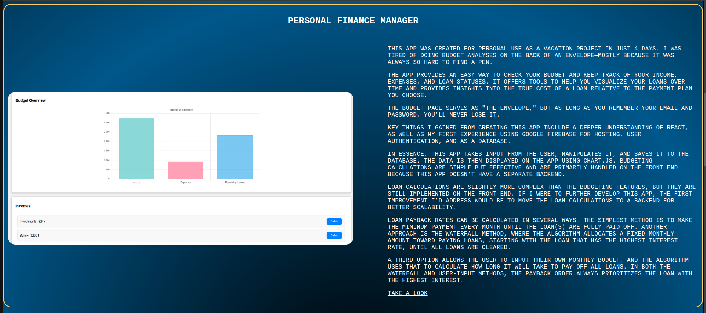

# Portfolio
https://portfolio-4444.web.app/

This is a frontend portfolio project built with React, showcasing projects and a diploma thesis about the Traveling Salesman Problem. The project is component-based and uses modern web development practices.

## Features
Project Showcase: A page displaying individual projects.

Diploma Thesis Viewer: A page displaying a PDF of the diploma thesis in an embedded viewer.
Responsive Design: Optimized for both large and small screens.
Component-Based Architecture: Each section and project is encapsulated in its own React component.

#### Components

Display Component: 
This component is designed to showcase a picture related to the project along with a written introduction. It is reused multiple times on the main page, with different values passed to customize its content.

Header and Footer: 
These are straightforward components that provide basic navigation and page structure.

Slideshow Component: 
This is a more complex component that leverages the Swiper library to create a "swipable container." The container houses interactive components, which represent projects from an earlier version of this portfolio. These project components are imported from the projects folder.

Pages:
Each page in the application is represented by its own dedicated file, keeping the structure modular and organized.

React: Core framework for building user interfaces.
@react-pdf-viewer: For displaying the PDF of the diploma thesis.
AOS (Animate on Scroll): For smooth animations during scrolling.
Development Practices
Component Modularity: Each section of the project is built as a reusable component.
Responsive Design: CSS media queries ensure optimal usability on all screen sizes.
Git Best Practices: A .gitignore file prevents sensitive files and unnecessary build artifacts from being committed.
Known Issues
PDF Download Prevention: The embedded PDF viewer does not allow downloads to ensure that the document is read-only.
Node Version Warning: You might encounter warnings during npm install due to deprecated packages in the current Node.js environment.